# Hackloi AI Cyber Lab

<p align="center">
  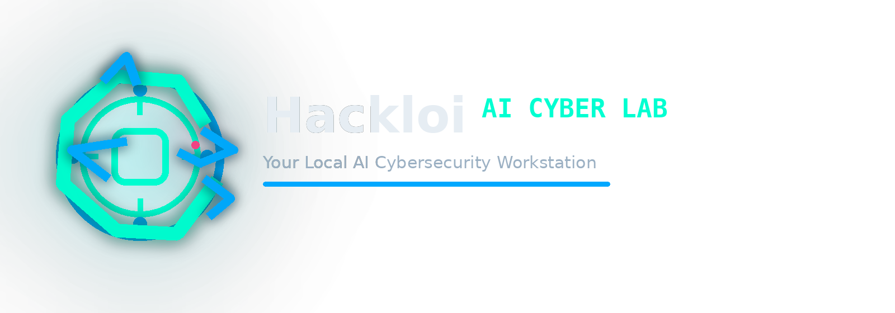
</p>

<p align="center"><strong>Your Local AI Cybersecurity Workstation</strong></p>

<p align="center">
  Local-first desktop app for AI chat, code assistance, scan analysis, agent workflows, and explicit cyber tooling.
</p>

<p align="center">
  
  
  
  
  
</p>

<p align="center">
  <a href="https://github.com/kely26/offline-ai-lab/releases/latest">Download Latest Release</a> ·
  <a href="https://github.com/kely26/offline-ai-lab/releases">Release History</a> ·
  <a href="docs/linkedin-launch-kit.md">Launch Kit</a>
</p>

<p align="center">
  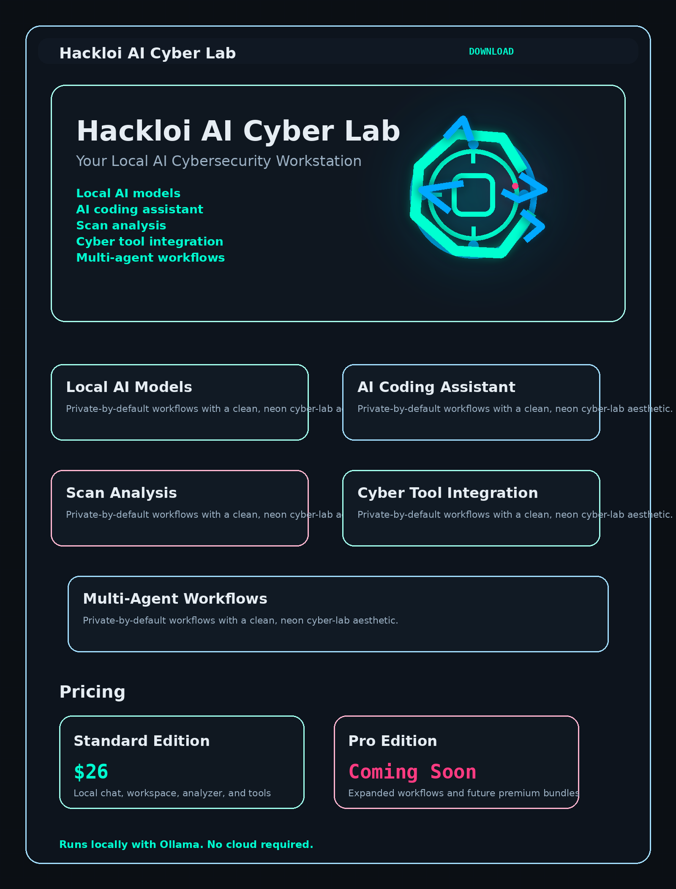
</p>

## What It Is

Hackloi AI Cyber Lab brings local AI workflows, code editing, technical review, and cybersecurity tooling into one desktop experience. It is designed for users who want a serious workstation feel without sending their files and prompts into a cloud-first workflow.

The product combines:

- local AI chat with streaming responses and code formatting
- a code workspace with Monaco Editor, tabs, search, replace, and AI actions
- structured scan analysis for recon and web-tool outputs
- specialist agents for coding, analysis, documentation, and coordination
- explicit tool execution with visible command previews and user confirmation

## Why It Stands Out

- Local-first by design: Ollama runs on loopback and user files stay on the machine.
- One workspace instead of five tabs: chat, code, scans, tooling, and model control live together.
- Built for technical workflows: this is aimed at real usage, not a toy AI wrapper.
- Presentation-ready: branding, onboarding, demo assets, and release materials are already included.

## Product Highlights

<p align="center">
  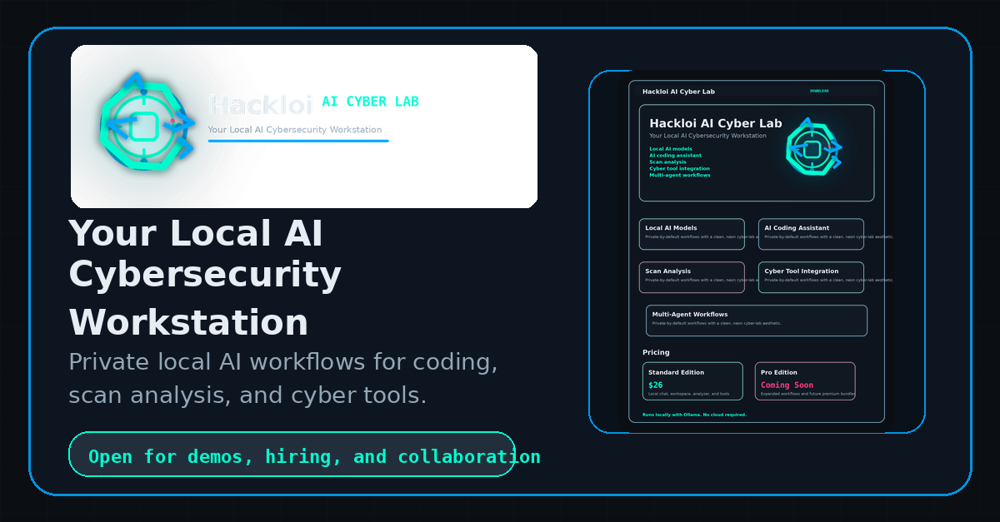
</p>

<p align="center">
  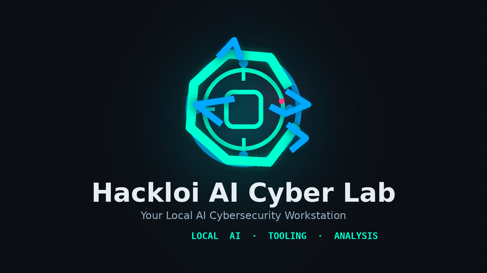
  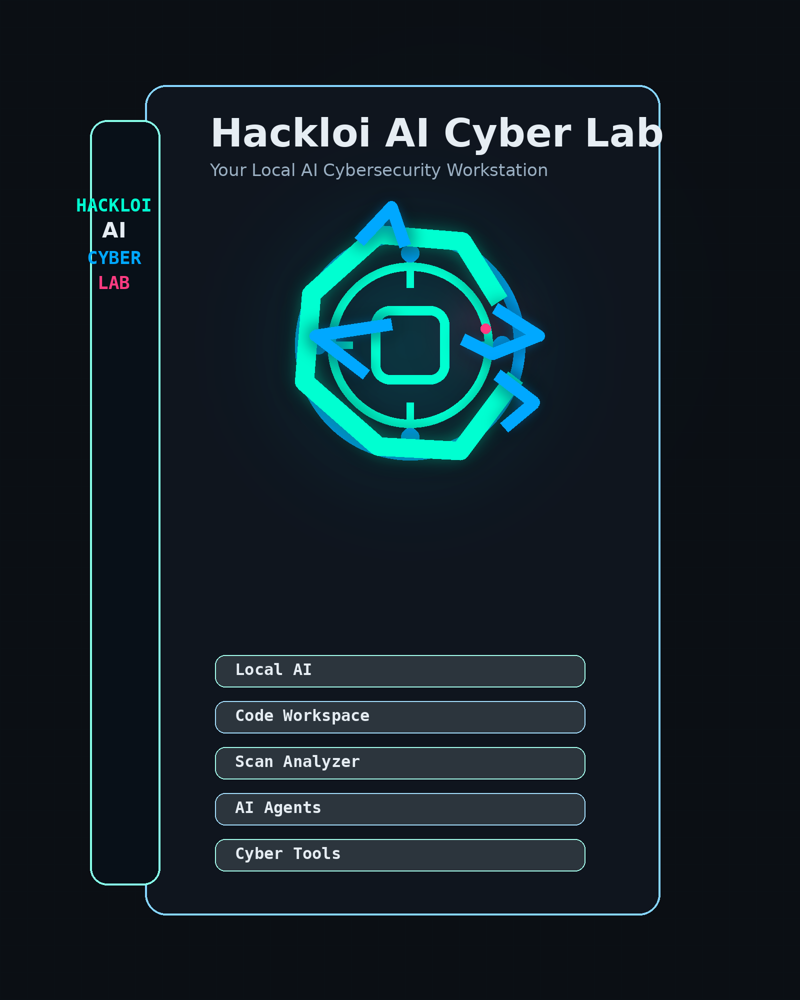
</p>

## Demo Preview

<p align="center">
  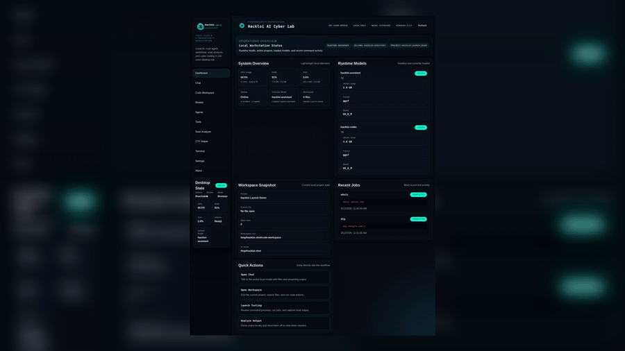
</p>

## Real App Screenshots

<p align="center">
  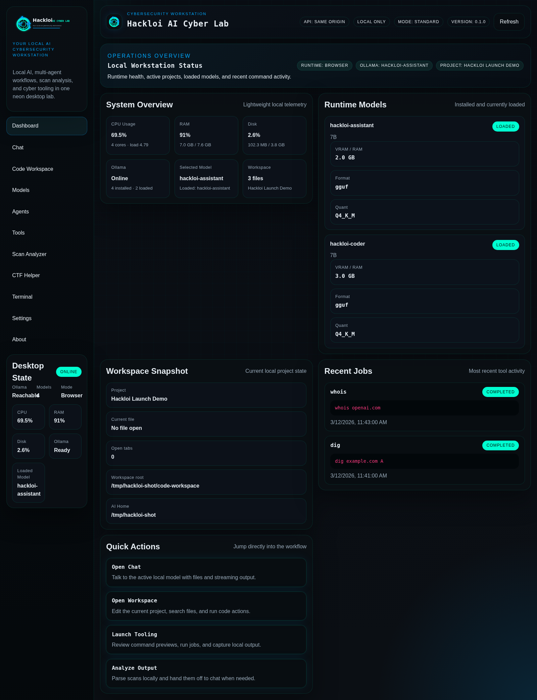
  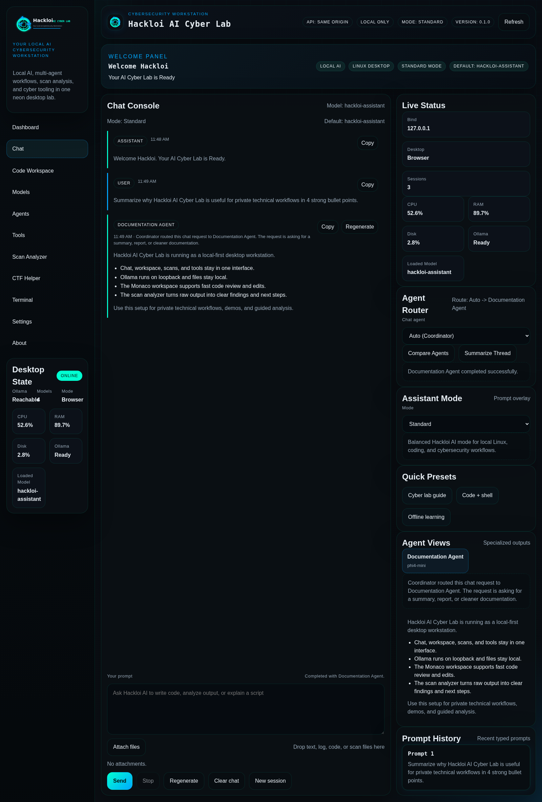
</p>

<p align="center">
  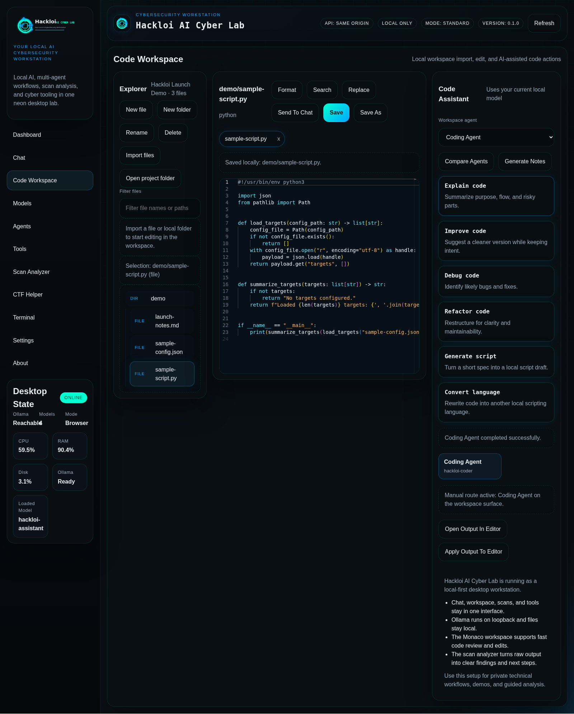
  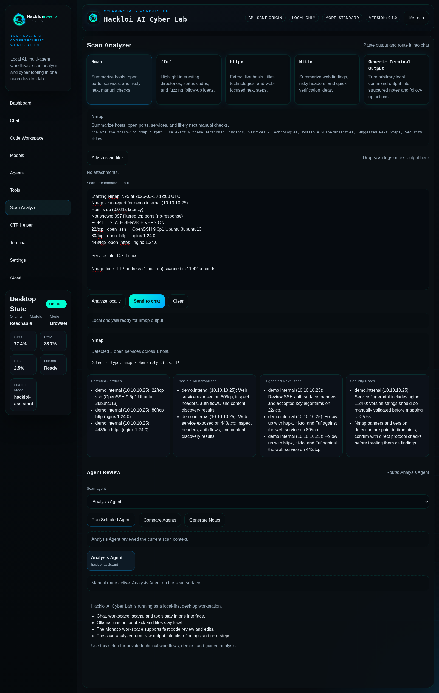
</p>

<p align="center">
  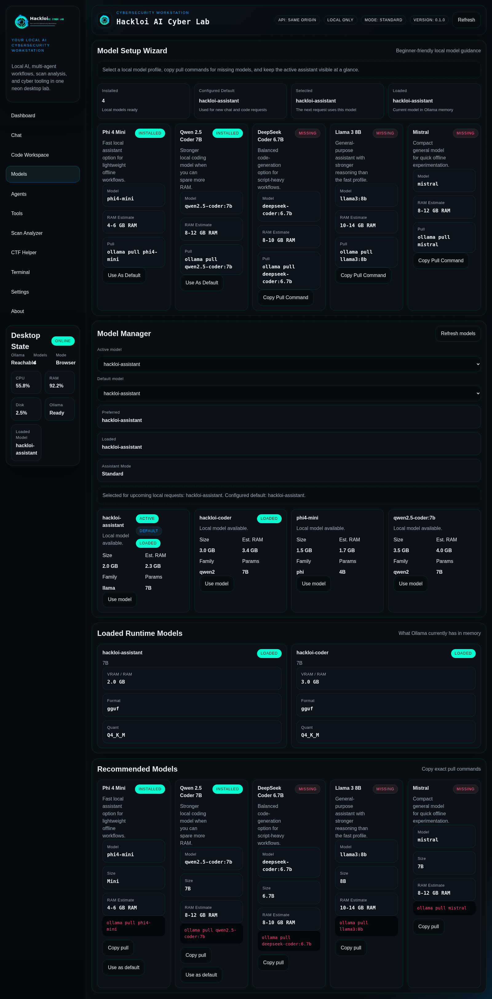
  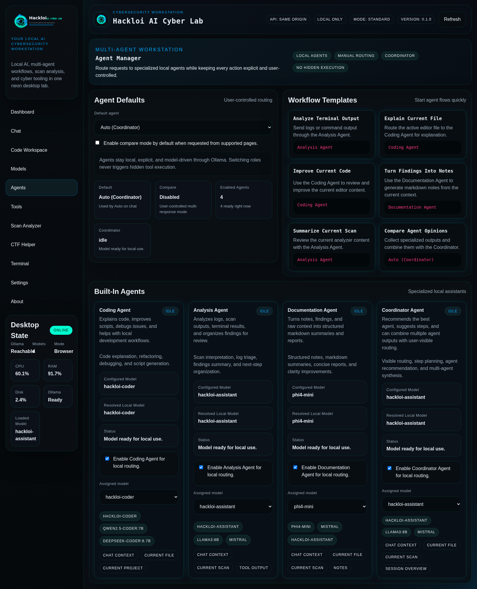
</p>

### Core Capabilities

- AI Chat: local chat experience with markdown, code blocks, prompt history, and attachments
- Code Workspace: Monaco-powered editor with project import, tabs, save flows, search, and replace
- Scan Analyzer: structured findings from common scan output with clear summaries
- Agent System: Coding, Analysis, Documentation, and Coordinator roles with model assignment
- Model Manager: installed models, runtime state, recommendations, and setup guidance
- Tool Launcher: `nmap`, `ffuf`, `httpx`, `subfinder`, `nikto`, `whois`, and `dig`
- Desktop Runtime: Tauri packaging, onboarding, settings, telemetry, and release-ready branding

## Local AI And Privacy

Hackloi AI Cyber Lab is built around local execution:

- Local Ollama endpoint: `http://127.0.0.1:11434`
- Local app UI host: `127.0.0.1`
- No cloud requirement for chat, workspace, scan analysis, or agent workflows
- No remote file upload
- Tool execution requires explicit user confirmation

## Quick Start

### Download Linux Build

Grab the latest Debian package from the [GitHub Releases page](https://github.com/kely26/offline-ai-lab/releases/latest). The packaged app is aimed at Kali, Debian, Ubuntu, and similar Linux desktops.

```bash
wget https://github.com/kely26/offline-ai-lab/releases/download/v0.1.0/hackloi-ai-cyber-lab_0.1.0_amd64.deb
sudo apt install ./hackloi-ai-cyber-lab_0.1.0_amd64.deb
```

## Branding Assets

For launch posts, release previews, and repository presentation, the project also includes the core brand visuals directly in the repo:

<p align="center">
  
</p>

<p align="center">
  
</p>

<p align="center">
  
  
</p>

<p align="center">
  
  
</p>

### Install Desktop Prerequisites

```bash
sudo apt update
sudo apt install -y libwebkit2gtk-4.1-dev build-essential curl wget file libxdo-dev libssl-dev libayatana-appindicator3-dev librsvg2-dev
```

### Install Dependencies

```bash
npm install
```

### Set Up Local AI

```bash
./setup-local-ai.sh --profile fast
ollama pull phi4-mini
ollama pull qwen2.5-coder:7b
ollama pull deepseek-coder:6.7b
```

### Run The App

```bash
npm run tauri:dev
```

### Build The Linux Package

```bash
npm run tauri:build
```

Primary package output:

```text
src-tauri/target/release/bundle/deb/Hackloi AI Cyber Lab_0.1.0_amd64.deb
```

## Demo Assets

Use the built-in sample files for a clean walkthrough:

- [`demo-data/sample-script.py`](demo-data/sample-script.py)
- [`demo-data/sample-terminal-output.log`](demo-data/sample-terminal-output.log)
- [`demo-data/sample-scan.txt`](demo-data/sample-scan.txt)
- [`demo-data/sample-config.json`](demo-data/sample-config.json)

Suggested demo flow:

1. Start on `Dashboard`.
2. Open `Chat` and ask the Coding Agent to explain the sample script.
3. Import `demo-data` into the `Code Workspace`.
4. Paste the sample scan into `Scan Analyzer` and run local analysis.
5. Open `Agents` and show model assignments and the coordinator flow.
6. Open `Models` and show the local model setup.

## Repository Guide

- [`docs/release-description.md`](docs/release-description.md): release summary and positioning
- [`docs/landing-page-copy.md`](docs/landing-page-copy.md): homepage messaging
- [`docs/release-checklist.md`](docs/release-checklist.md): ship checklist
- [`docs/screenshots/README.md`](docs/screenshots/README.md): clean screenshot capture notes
- [`docs/linkedin-launch-kit.md`](docs/linkedin-launch-kit.md): launch copy and media order
- [`LICENSE`](LICENSE): MIT license

## Repository Structure

```text
offline-ai-lab/
├── branding/
├── demo-data/
├── docs/
├── lib/
├── src-tauri/
├── webui/
├── README.md
└── package.json
```

## Current Direction

This repository preserves the current Hackloi AI Cyber Lab application and presentation assets. The focus is a polished local-first desktop product for technical users who care about privacy, speed, and a credible cybersecurity workflow.
